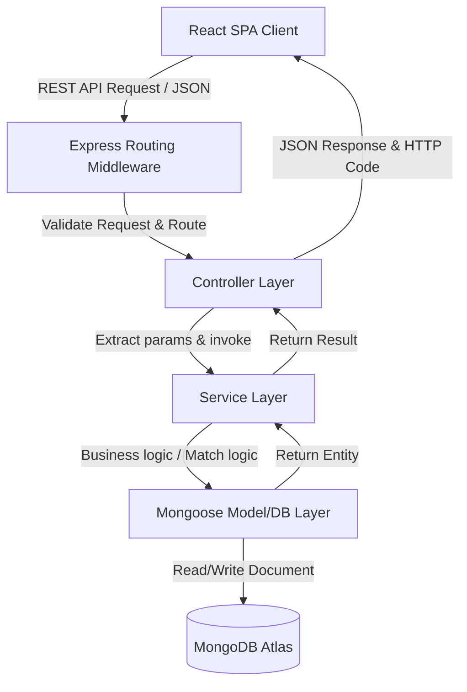

# System Architecture: Skilltern

This document describes the design principles, authentication flow, and component relationships of the Skilltern matching platform.

## Architecture Model: Separation of Concerns (MVC-Service Pattern)

Skilltern is built upon a clean multi-layer MVC-Service architecture:

1. **Routing Layer (`/routes`):** Handles URI mapping and applies relevant middlewares (auth, rate limits, validators).
2. **Controller Layer (`/controllers`):** Parses parameters, triggers business services, and manages HTTP responses.
3. **Service Layer (`/services`):** Encapsulates core business processes (e.g., scoring algorithms, gap analyses, notification emails). Keep controllers thin.
4. **Repository/Model Layer (`/models`):** Manages database access, index setup, and schema constraints.

---

## Authentication & Authorization Architecture

### 1. Registration & Login Flow
- **Registration:** Users choose a role (`student` or `recruiter`). Student registration creates a core user record and registers a corresponding empty `StudentProfile`. Recruiter registration creates a user record and registers a `RecruiterProfile` waiting for Admin approval.
- **Login:** Returns a stateless JWT containing payload `{ userId, role }`.
- **JWT Storage:** Set as an `httpOnly` secure cookie (`token`) to prevent XSS credential theft.

### 2. Authorization Rules (RBAC)
We apply role-based access control (RBAC) middleware:
- **Public Routes:** Registration, Login, OAuth redirection, public internship searches.
- **Student Routes:** Profile CRUD, upload CV, apply for internships, list recommendations, bookmark internship, rate internships.
- **Recruiter Routes:** Profile CRUD, post/edit/delete internships, view applicants, update applicant status, rate interns.
- **Admin Routes:** Approve recruiters, list all users/postings, archive content, view operational dashboard.

---

## State Management & Client API Strategy

### 1. Global Store (Zustand)
- Stores application-wide states: `auth` (user details, role, current authentication status), notifications list, and theme config.
- Keeps client state in sync with local storage for auth restoration.

### 2. API Communication (Axios Wrapper)
- Intercepts requests to handle authorization headers if token is read from local storage, or relies on automatic cookie forwarding (`withCredentials: true`).
- Standardized response/error handlers intercept API errors (like `401 Unauthorized`) to clear local storage and route back to `/login`.
