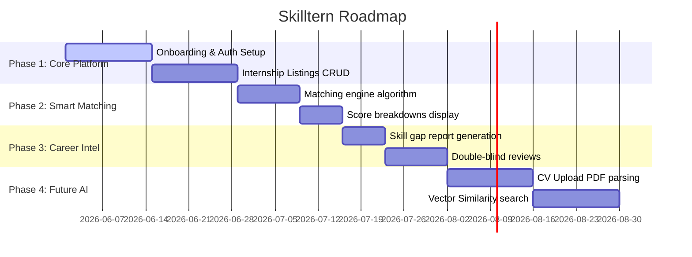

# Product Roadmap: Skilltern

This document schedules the incremental development goals for Skilltern across key project milestones.

## Chronological Release Phases

### Phase 1: Foundation & Onboarding (Weeks 1 - 2)
- **Goal:** Set up secure account creation, user roles, profile fields, and core internship CRUD operations.
- **Key Deliverables:** Login pages, profile forms, file uploader API, and simple job listings feeds.

### Phase 2: Smart Matching Engine (Week 3)
- **Goal:** Integrate automated recommendation feeds based on overlapping skills and interests.
- **Key Deliverables:** Matching algorithms, match score badges (`85% Match`), and cached match records.

### Phase 3: Career Intelligence (Week 4)
- **Goal:** Drive student improvement through skill gap reporting and feedback loops.
- **Key Deliverables:** Missing skills checklists, learning recommendation courses, ratings, and reviews.

### Phase 4: Post-MVP Enhancements (Future)
- **Goal:** Add AI-native resume parsing, vector-based similarity indexing, and interview coaching features.
