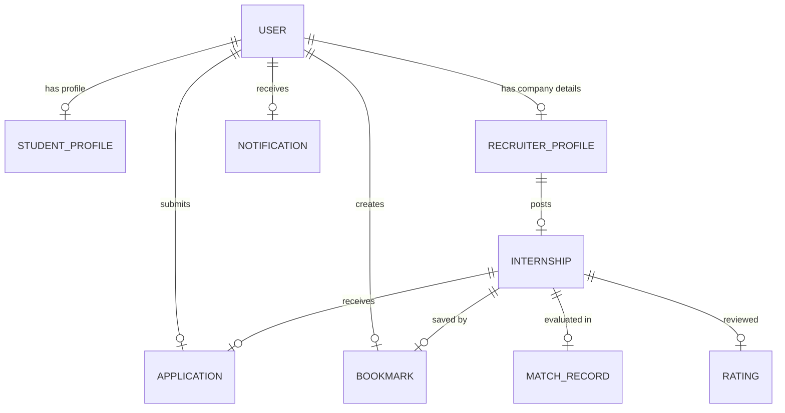

# Entity Relationship Diagram: Skilltern

This document visualizes and describes the relational database design for the Skilltern MongoDB schema model.

## Entity Relationship Diagram

## Entity Descriptions

1. **User (Identity):** The core authentication credentials and roles table. Every user is mapped to exactly one `student_profile` or `recruiter_profile` based on their role selection.
2. **Student Profile:** Contains specific details for matching (skills list, university name, project list, CV document reference link).
3. **Recruiter Profile:** Stores recruiter company descriptions, website links, logo pointers, and administrative verification status.
4. **Internship:** Represents published internship postings. Maintained by a single Recruiter.
5. **Application:** Relates a Student Profile to an Internship. Stores matching logs and application lifecycle status states.
6. **Bookmark:** A many-to-many lookup table connecting Students to saved Internships.
7. **Match Record:** Cached scores generated by the recommendation services.
8. **Rating:** Reviews submitted post-internship. Relates an Internship to reviewer and reviewee IDs.
