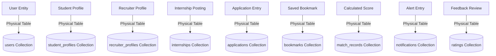

# Entity Collection Mapping: Skilltern

This document describes the mapping between system conceptual entities and their MongoDB physical collection names, schemas, and indexing.

## Entity Mapping Detail

1. **User Identity:**
   - Conceptual Entity: User (Registration credentials, system auth roles).
   - Mongo Collection: `users`
   - Key Index: `email` (Unique)
2. **Student Profile:**
   - Conceptual Entity: StudentProfile (Educational details, skills arrays, projects catalog).
   - Mongo Collection: `student_profiles`
   - Key Index: `userId` (Unique), `skills` (Multikey)
3. **Recruiter Profile:**
   - Conceptual Entity: RecruiterProfile (Corporate brand narrative, approval status).
   - Mongo Collection: `recruiter_profiles`
   - Key Index: `userId` (Unique)
4. **Internship Opportunity:**
   - Conceptual Entity: Internship (Title, description, required skills, deadliness).
   - Mongo Collection: `internships`
   - Key Index: `recruiterId`, `category`, `requiredSkills` (Multikey)
